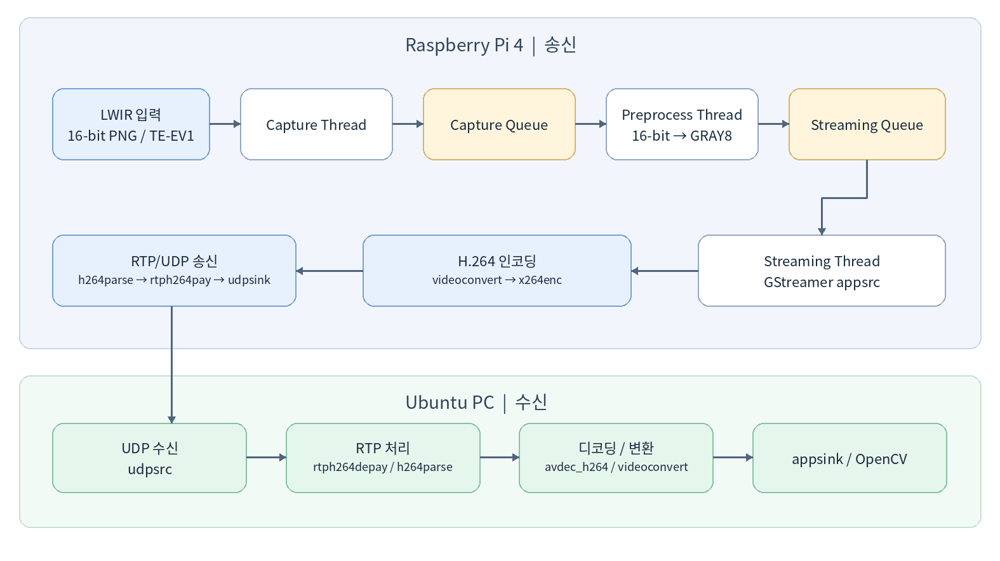
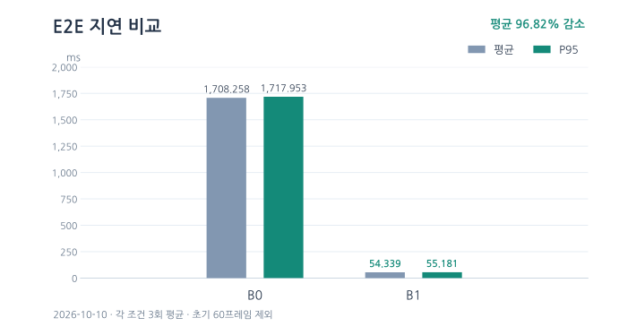
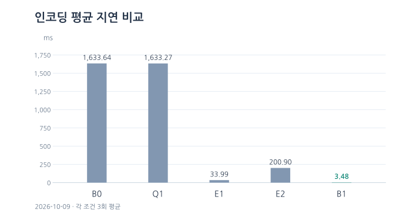
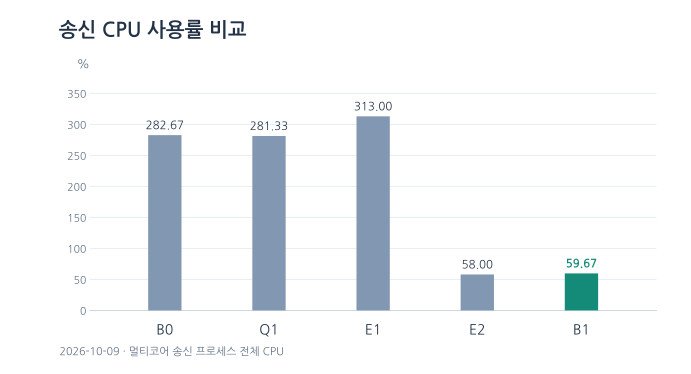
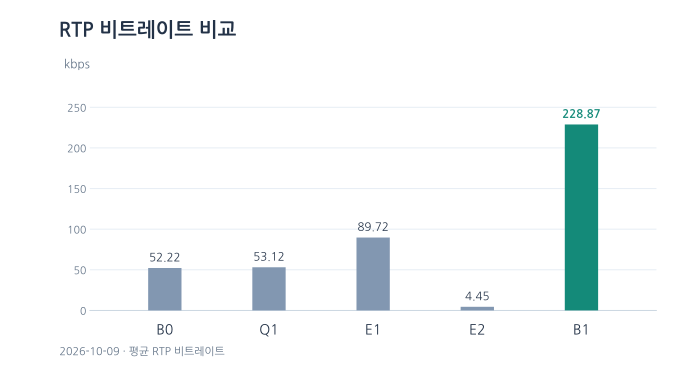

# H.264 Streaming Performance Analysis Using i3system TE-EV1 LWIR Dataset

i3system의 **TE-EV1 장파장 적외선(LWIR) 카메라**로 수집한 16-bit 열영상 데이터셋을 Raspberry Pi 4에서 30 FPS로 재생하여 영상 송신 성능을 분석한 프로젝트입니다.

**Capture → 전처리 → H.264 인코딩 → 네트워크 전송 → PC 디코딩** 파이프라인의 주요 병목을 식별하고 성능을 최적화.

**핵심 성과: E2E 지연 96.82% 감소, CPU 사용률 78.89% 감소.**

## 1. 파이프라인 구조

## 2. 비교 조건

| 조건 | 변경 설정 | 확인 목적 |
|---|---|---|
| **B0** | 기본 설정 | 기준 성능 |
| **Q1** | 애플리케이션 Queue Depth = 2, FIFO | 스레드 간 큐 적체 영향 |
| **E1** | `x264enc tune=zerolatency` | 인코더 내부 프레임 보류 감소 |
| **E2** | `x264enc speed-preset=ultrafast` | 인코딩 연산량 및 CPU 사용률 감소 |
| **B1** | `zerolatency` + `ultrafast` | 지연·자원 사용량 동시 최적화 |

## 3. 측정 지표

| 지표 | 측정 범위 |
|---|---|
| **E2E 지연 (평균 / P95)** | Raspberry Pi 데이터셋 프레임 공급 → PC `appsink` 입력 |
| **인코딩 지연 (평균 / P95)** | `x264enc` 입력  → 출력 |
| **CPU / 최대 RSS** | Raspberry Pi의 CPU 사용률 / 최대 메모리 사용량 |
| **RTP 비트레이트** | RTP 패킷 바이트 수 및 전송 시간 기준 |
| **FPS / 프레임 검증** | 송신·디코딩 프레임 수, Frame ID 매칭·역전·중복 |

## 4. 성능 분석 결과

### 4.1 E2E 지연 — B0와 B1

| 지표 | B0 | B1 | 개선 |
|---|---:|---:|---:|
| **평균 E2E** | **1,708.258 ms** | **54.339 ms** | **96.82% 감소** |
| E2E P95 | 1,717.953 ms | 55.181 ms | 96.79% 감소 |

**E2E는 데이터셋 프레임 공급부터 PC `appsink` 입력까지의 지연**. 장치 시계는 NTP로 동기화했으며 실험 직전 측정된 오프셋은 약 +0.069 ms였습니다.

### 4.2 인코딩 평균 지연 — 5조건 비교

Q1은 B0와 차이가 거의 없었으나, E1의 `zerolatency` 적용 시 인코딩 지연이 크게 감소. 
따라서 주요 병목은 **인코더 내부 프레임 보류**

### 4.3 송신 CPU 사용률 — 5조건 비교

B1의 송신 프로세스 CPU 사용률은 **282.67% → 59.67% (78.89% 감소)** 

### 4.4 RTP 비트레이트 — 5조건 비교

B1에서는 비트레이트가 **52.22 → 228.87 kbps (약 4.38배 증가)** 
## 5. 결론

- **최적화:** `zerolatency` + `ultrafast` 조합(B1)으로 E2E 지연을 96.82% , CPU 사용률을 78.89% 감소.
